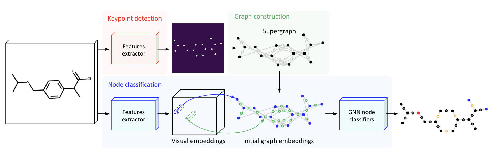

# MolGrapher

This is the repository for [MolGrapher: Graph-based Visual Recognition of Chemical Structures]().
The code will be released soon.



### Citation
```
@article{
    MolGrapher,
    title = {MolGrapher: Graph-based Visual Recognition of Chemical Structures},
    author = {},
    journal = {},
    publisher = {},
    doi = {},
    year = 2023,
}
```
### USPTO-30K Benchmark

USPTO-30K is available on [Hugging Face](https://huggingface.co/datasets/ds4sd/USPTO-30K).
- USPTO-10K contains 10,000 clean molecules, i.e. without any abbreviated groups. 
- USPTO-10K-abb contains 10,000 molecules with superatom groups.
- USPTO-10K-L contains 10,000 clean molecules with more than 70 atoms. 

### Synthetic Data

The synthetic dataset is available on [Hugging Face](https://huggingface.co/datasets/ds4sd/MolGrapher-Synthetic-300K).

